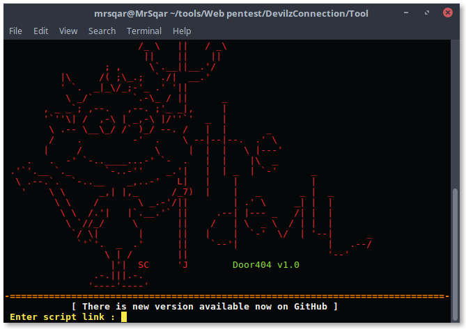
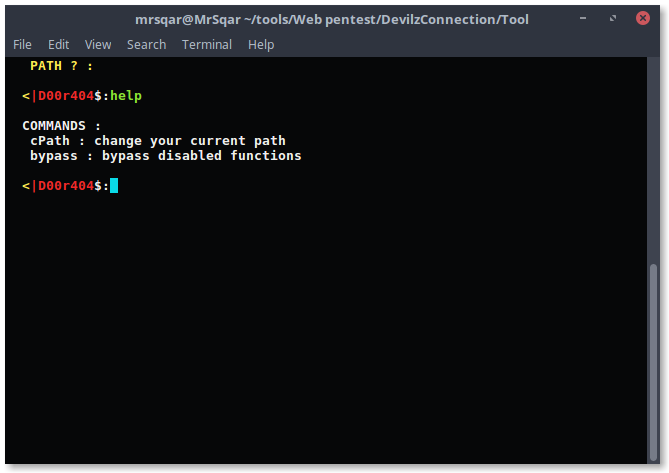
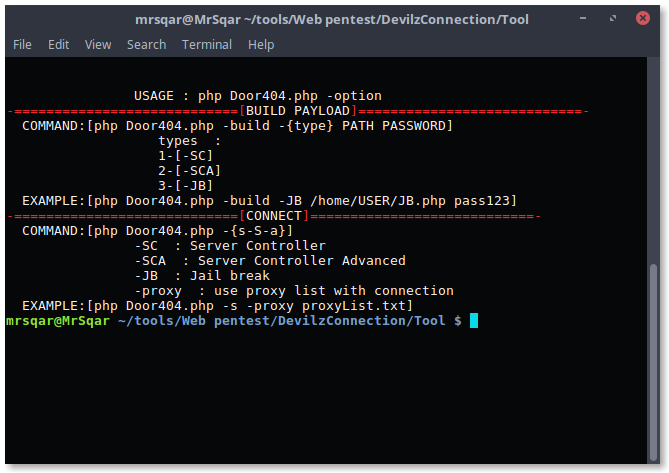

# Door404
<b>Door404 is Open Source Project Developed By <a href="https://github.com/MrSqar-Ye">MrSqar</a> & <a href="https://github.com/Rizer0">Rizer</a>
 This Project Developed For 2 Reasons
 <ul>First<li>" Help Beginners to learn coding . "</li>Second<li>" Help Newbie Servers Managers To Learn New Protection Tricks "</li> </ul>
# Requirements 
<ul>
<li>
PHP
</li>
<li>
PHP CUrl
</li>
</ul>
<h1> OS </h1>
<ul><li>
Linux
</li></ul>

# Screen Shots

 

 
<h1> Video :</h1>
 
<h1> License</h1>
<b>DWTFPL 

    DO WHAT THE FUCK YOU WANT TO PUBLIC LICENSE 
    TERMS AND CONDITIONS FOR COPYING, DISTRIBUTION AND MODIFICATION 
